## 🧑‍💻 About

- 🎓 Student passionate about **Autonomous Driving** and **Robotics**
- 🔬 Research interests: SLAM · Computer Vision · Deep Learning · Reinforcement Learning
- 🛠️ Building tools and systems that make machines smarter
- 🌱 Currently exploring multi-sensor fusion and real-time perception

## 📊 GitHub Stats

<table align="center">
  <tr>
    <td>
      
    </td>
    <td>
      
    </td>
  </tr>
</table>

## 🛠️ Featured Projects

<table align="center">
  <tr>
    <td>
      
    </td>
    <td>
      
    </td>
  </tr>
</table>

  

 

**✨ *"Move fast and build things."* ✨**

 

