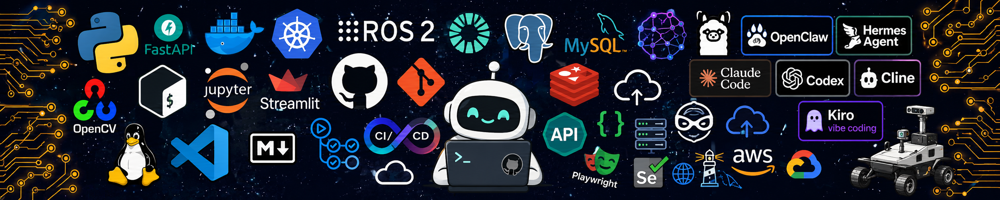

## 🧑‍💻 About

- 🤖 Passionate about **Robotics, Embodied AI, and Autonomous Systems**
- 🛠 Research & development: **SLAM, LiDAR/vision-based 3D mapping, local replanning, semantic object understanding, edge planning & control**
- 💻 Tech stack & tools: **Python, FastAPI, ROS2, OpenCV, PyTorch, Jupyter, Streamlit, Docker, VS Code, MySQL/PostgreSQL, Redis, CI/CD, Git/GitHub**
- 🤖 Agentic & AI tools: **OpenClaw, Hermes Agent, Claude Code, Codex, Cline, Kiro/vibe coding**
- 🌱 Currently exploring **real-time 3D reconstruction, LiDAR-inertial odometry, VLM integration for semantic robotics, and lightweight edge deployments**
- 🚀 Combining **AI tooling + robotic perception & planning** to accelerate experiments and prototypes

## 📊 GitHub Stats

<table align="center">
  <tr>
    <td>
      
    </td>
    <td>
      
    </td>
  </tr>
</table>

## 🛠️ Featured Projects

<table align="center">
  <tr>
    <td>
      
    </td>
    <td>
      
    </td>
  </tr>
</table>

  

 

**✨ *"Move fast and build things."* ✨**

 

